# Task Record System (Rust + MySQL)

A command-line application in Rust that manages book records stored in MySQL. Offers full CRUD, sorting, and CSV export via a user-friendly menu.

## Project Structure


## 📸 Screenshots

All interactions take place in the terminal. See below for each step in action.

| Step                          | Screenshot                                            |
|-------------------------------|-------------------------------------------------------|
| MySQL Setup                   | 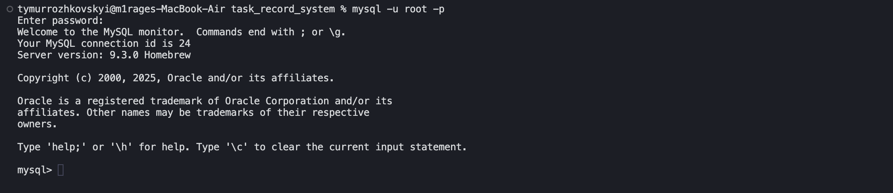           |
| Program Startup               | 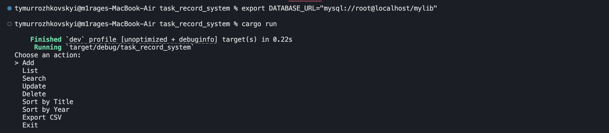       |
| Add a Record                  | 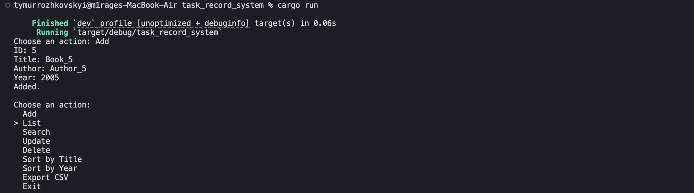         |
| View All Records              | 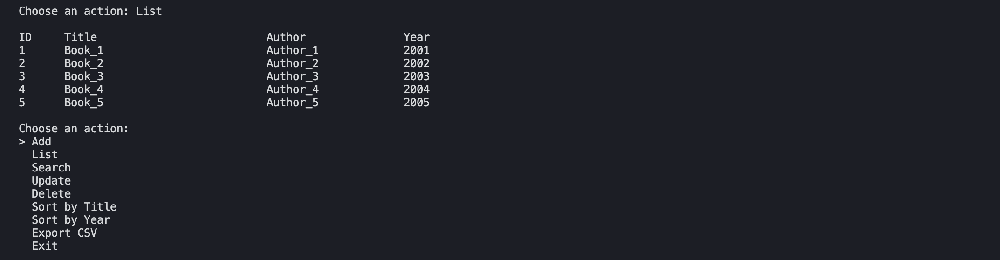     |
| Search by ID                  | 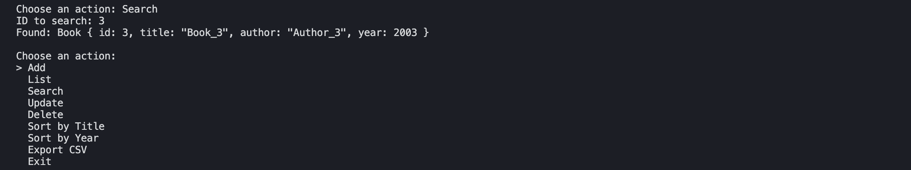             |
| Update a Record               | 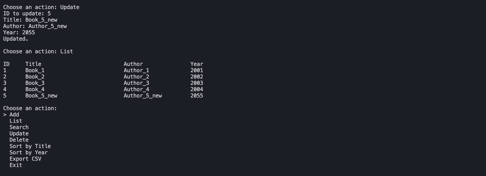             |
| Delete a Record               | 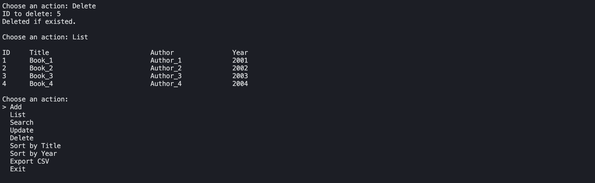             |
| Sort Records                  | 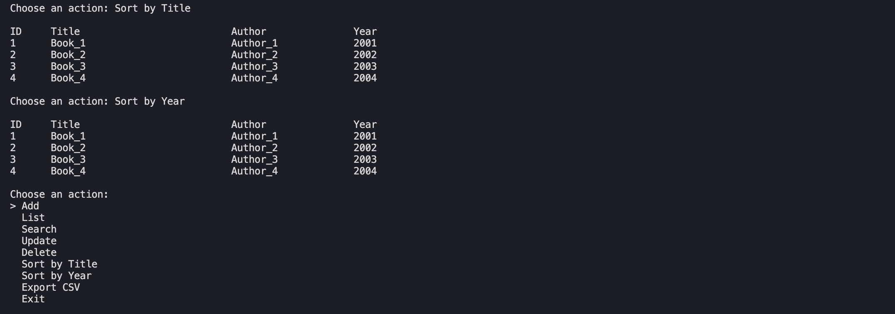                 |
| Export to CSV (CLI prompt)    | 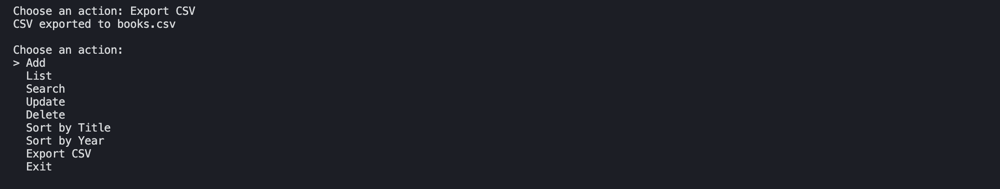             |
| View CSV File (in editor)     | 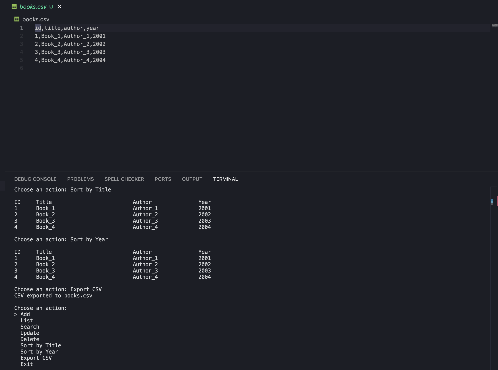           |
| Exit                          | 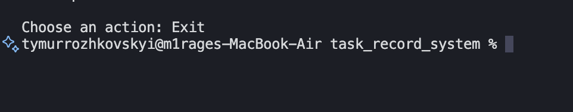                 |

## Usage Flow

1. **MySQL Setup**  
   Execute `schema.sql` to create the `mylib` database and `books` table (see [MySQL Setup](task/images/mysql_start.png)).

2. **Start the Program**  
   Run `cargo run` to launch the interactive menu (see [Program Start](task/images/program_start.png)).

3. **Add a Record**  
   Choose **Add**, fill in `ID`, `Title`, `Author`, `Year` (see [Add Item](task/images/program_add_item.png)).

4. **View All Records**  
   Choose **List** to display every record in the database (see [Show Items](task/images/program_show_items.png)).

5. **Search**  
   Choose **Search**, enter an `ID` to locate a book (see [Search](task/images/program_search.png)).

6. **Update**  
   Choose **Update**, enter an `ID`, then provide new values or leave blank to keep existing (see [Update](task/images/program_update.png)).

7. **Delete**  
   Choose **Delete**, enter an `ID` to remove it (see [Delete](task/images/program_delete.png)).

8. **Sort**  
   Choose **Sort by Title** or **Sort by Year** to reorder your list (see [Sort](task/images/program_sort.png)).

9. **Export to CSV**  
   Choose **Export CSV** to generate `books.csv` in the project root (see [Export](task/images/program_export.png)), then open it in your editor to view (see [CSV All](task/images/program_csv_all.png)).

10. **Exit**  
    Choose **Exit** to quit the application (see [Exit](task/images/program_exit.png)).

---

## OOP in Rust vs C++

This project is structured with object-oriented principles in mind:
- `Book` is a data struct representing one record.
- Logic like `add`, `update`, `delete` is organized in separate async functions.
- All operations use a central connection pool to interact with MySQL.

**Compared to C++**: Rust uses `struct` + `impl` blocks instead of classes; memory is managed without manual `new`/`delete`, and ownership ensures safety without garbage collection.

---

## How to Launch the Project From Scratch

1. **Install Requirements**

```bash
# Install Rust
curl --proto '=https' --tlsv1.2 -sSf https://sh.rustup.rs | sh

# Install MySQL Server
# (Mac: brew install mysql | Ubuntu: sudo apt install mysql-server)
````

2. **Clone or Download the Project**

```bash
git clone https://github.com/your_username/record-management-system.git
cd record-management-system
```

3. **Start MySQL and Create the Database**

```bash
mysql -u root -p
```

Then in the MySQL shell:

```sql
CREATE DATABASE mylib;
USE mylib;
SOURCE schema.sql;
```

4. **Set the Database URL**

```bash
export DATABASE_URL="mysql://root@localhost/mylib"
```

5. **Run the App**

```bash
cargo run
```

Use arrow keys to navigate the menu. All features are available via keyboard.
